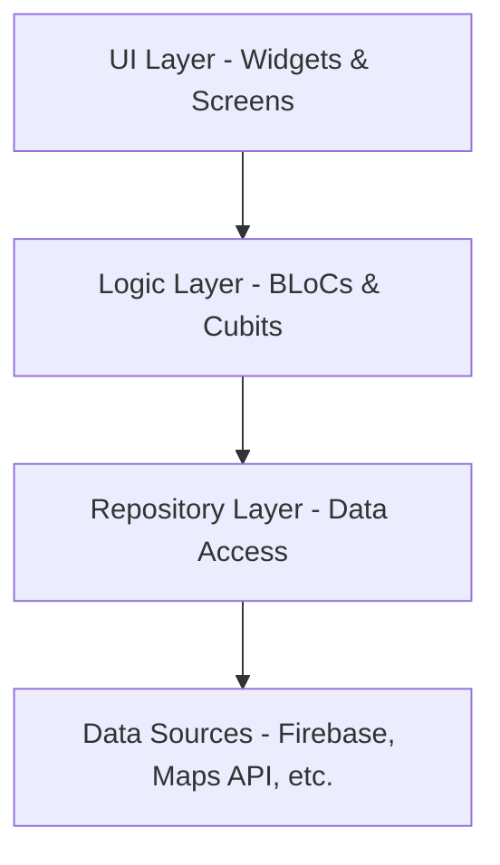

# Technical Architecture - NSU Ride

This document describes the architectural patterns and technical decisions implemented in the NSU Ride mobile application.

---

## 🏗️ Overview

The app follows a **Layered Architecture** combined with the **BLoC (Business Logic Component)** pattern for state management. This ensures a clean separation of concerns, making the codebase maintainable, testable, and scalable.

---

## 🧊 State Management (BLoC)

We use `flutter_bloc` to manage all complex states. Each major feature area has its own BLoC/Cubit:

- **AuthBloc:** Handles user authentication states (LoggedIn, LoggedOut, Authenticating).
- **RideBloc:** Manages the lifecycle of a ride (Requesting, Searching, InProgress, Completed).
- **LocationCubit/Bloc:** Handles real-time location updates for both Students and Riders.
- **RiderBloc:** Manages rider-specific states like online/offline status and incoming request queues.
- **WalletCubit:** Manages balance updates and transaction history.

### Typical Data Flow:
1. **User Action:** User clicks "Request Ride".
2. **Event Dispatch:** UI dispatches a `RequestRideEvent` to the `RideBloc`.
3. **Logic Consumption:** `RideBloc` calls the `RideRepository`.
4. **State Transition:** `RideBloc` emits `RideLoadingState` then `RideRequestedState`.
5. **UI Reaction:** The screen rebuilds to show the searching animation.

---

## 🗄️ Repository Pattern

Repositories act as a buffer between the logic layer and external data sources (mostly Firebase). They abstract the underlying data fetching logic.

- **AuthRepository:** Wraps `FirebaseAuth` and handles Firestore user profile creation.
- **RideRepository:** Manages Firestore `rides` collection, handles real-time streams of ride updates.
- **StudentRepository / RiderRepository:** Role-specific data handling.

---

## 🛰️ Real-time Features

### Location Tracking
The app uses the `geolocator` package to get coordinates and `geoflutterfire_plus` for geo-querying.
- **Riders:** Stream their current location to Firestore when "Online".
- **Students:** Query Firestore for nearby riders within a specific radius to display them as "Ghost Riders" on the map.

### Live Ride Updates
We utilize Firestore's `snapshots()` to create a real-time reactive bridge between the student and the rider. When a rider updates the status of a ride in Firestore, the student's `RideBloc` receives the update via a stream subscription and updates the UI instantly.

---

## 💳 Payment Integration

Payments are handled via the **Paystack SDK**.
- **Flow:** User enters amount -> Serverless function/Direct SDK call initializes transaction -> Paystack UI handles card entry -> On success, the `WalletRepository` updates the user's balance in Firestore.

---

## 🗺️ Mapping & Navigation

- **Google Maps Flutter:** Used for the primary interface to show markers, polylines, and current user location.
- **URL Launcher:** When a rider starts a trip, the app provides a button to open Google Maps (external) with pre-filled destination coordinates for turn-by-turn navigation.

---

## 🧪 Best Practices Observed

- **Clean UI Files:** Keep logic out of the `build` method.
- **Strong Typing:** Use Data Models for all Firestore entities.
- **Code Reuse:** Shared widgets for common UI elements (buttons, inputs, cards).
- **Error Handling:** Centralized error handling within BLoCs to provide user-friendly feedback.
